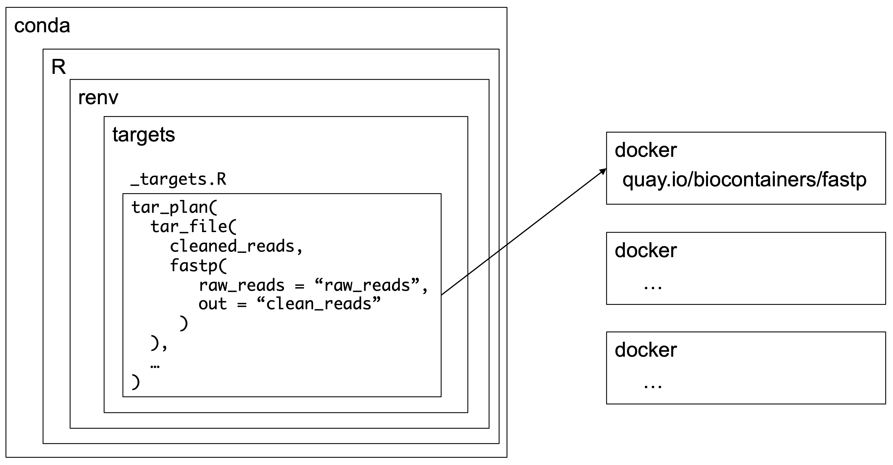

```{r setup, include=FALSE}
knitr::opts_chunk$set(echo = TRUE)
library(targets)
library(tarchetypes)
library(xaringanthemer)
style_mono_accent(
  base_color = "#006682",
  text_font_size = "1.2rem",
  extra_css = list(
    ".small" = list("font-size" = "60%")
  ))
```

## Using {targets} for bioinformatics pipelines

**Joel Nitta**

rOpenSci Community Call <span style = 'font-size: 120%;'>2023-01-31</span>

<br><br>

<br><br><br>https://joelnitta.github.io/comm-call-bioinfo-targets

---

## Self-introduction

.pull-left[
@joel_nitta

https://joelnitta.com

- Project Research Associate @ [Tokyo University](http://iwasakilab.k.u-tokyo.ac.jp/)

- Research interests: Ecology and evolution of __ferns__
]

.pull-right[

.small[Photo: J-Y Meyer]
]

---
## Blog post

https://www.joelnitta.com/posts/2021-11-16_r-bioinfo-flow/

---
## What is "bioinformatics"?


.small[https://sbc.shef.ac.uk/blog/nextflow/]

---
## What is "bioinformatics"?

For the purposes of this talk, **any analysis that involves calling many programs outside of R** and **reading from / saving to external files**.

---
class: inverse, center, middle

# Our goal: reproducible pipelines

---
## Using {targets} for bioinformatics



---
## Workflow with files

.pull-left[

- Use `tar_file()` in targets plan

- Store files in **`_targets/user/`**

- \*Bonus\*: Snapshot your targets cache with [{gittargets}](https://github.com/ropensci/gittargets)
]


<br>
<br>
<br>
<br>
<br>
<br>
<br>
<br>
<br>
<br>


Allows you to roll back to a particular
code commit in {targets}, then checkout the matching workflow state 
**without re-running everything**

---
## Workflow with files

My recommendation:

```
_targets/
└── user
    ├── data
    ├── intermediates
    └── results
```

- `data`: raw data files
- `intermediates`: output / input of intermediate steps
- `results`: final output (e.g., manuscript)

---
## Wrapper functions

R functions that call external programs.

- `system()`: most basic form, just runs exactly the input given
- `system2()`: slightly more complicated
- **`processx::run()`**
  - allows for asynchronous processes
  - can specify different working directory
  - redirection of `stderr` and `stdout`
  - many other features

Syntax:

```r
processx::run(command, args)
```

```r
processx::run("ls", c("-l", "-h")) # same as `ls -l -h`
```

---
## Use docker for external programs

.pull-left[

> A Docker container ... is a lightweight, **standalone**, executable **package of software** that includes everything needed to run an application

- **Don't need to install program (and all of its dependencies)**

]

.pull-right[

]

.footnote[https://www.docker.com/resources/what-container/]

---
## Use docker for external programs

- Docker image for `fastp`:

```
quay.io/biocontainers/fastp:0.23.1--h79da9fb_0
```

Part after `:` is the tag (version, here `0.23.1`)

- Instead of installing `fastp` from sratch, can do:

```
docker run quay.io/biocontainers/fastp:0.23.1--h79da9fb_0 fastp
```

---
## Use docker for external programs

.pull-left[
We don't have time to cover details of Docker today

Recommended resource: 
- Carpentries Incubator Workshop ["Reproducible Computational Environments Using Containers"](https://carpentries-incubator.github.io/docker-introduction/index.html)
]

.pull-right[

]

---
## Where to find containers

- **Bioconda** https://bioconda.github.io/

- Biocontainers https://biocontainers.pro/

- Docker Hub* https://hub.docker.com/

All containers in Bioconda are also in Biocontainers

I find the search interface in **Bioconda** easier to use
  - look for `(see .../tags for valid values for <tag>)`

Containers in Bioconda and Biocontainers are **actively maintained and tested**

*Containers in Docker Hub come with no guarantees

---
## If you can't find a container...

[Roll your own](https://carpentries-incubator.github.io/docker-introduction/creating-container-images/index.html) (not covered here)

---
## Wrapping docker calls from R

babelwhale R package: https://github.com/dynverse/babelwhale

`babelwhale::run()` has similar syntax to `processx::run()`, but adds the container (image) name

.pull-left[
```{r, eval = FALSE}
babelwhale::run(
  container, #<<
  command, args)
```

```{r, eval = FALSE}
babelwhale::run(
  "alpine", #<<
  "ls", "-h")
```
]

---
## Loading files into docker: mounting

In order to connect the docker container to your files, you need to **mount** the directory.

```
docker run -v /path/to/local/dir:/path/to/container/dir
```

.center[

]

.small[https://bikramat.medium.com/docker-volume-63c50635e80c]

---
## Loading files into docker

```{r, eval = FALSE}
wd <- getwd()

babelwhale::run(
  container = "alpine",
  command = "ls",
  args = c("/wd_in_docker", "-h"),
  volumes = paste(wd, ":/wd_in_docker", sep = "") #<<
  )

```

This gets confusing with multiple files and folders...

---
## run_auto_mount()

Makes it easier to mount files.

**For any file or folder argument, just provide the local path and name it "file"**

```{r run-auto-ex-1, eval = FALSE}
babelwhale::run_auto_mount(
  container = "alpine",
  command = "ls",
  args = c(file = wd, "-h") #<<
  )
```

---
## Example of run_auto_mount(): clean reads with fastp
```{r, eval = FALSE, echo = TRUE}
# Download some example read files
download.file(
  url = "https://raw.githubusercontent.com/OpenGene/fastp/master/testdata/R1.fq",
  destfile = "R1.fq")
download.file(
  url = "https://raw.githubusercontent.com/OpenGene/fastp/master/testdata/R2.fq",
  destfile = "R2.fq")

babelwhale::run_auto_mount(
  container = "quay.io/biocontainers/fastp:0.23.1--h79da9fb_0",
  command = "fastp",
  args = c(
    "-i", file = "R1.fq",
    "-I", file = "R2.fq",
    "-o", file = "R1_trim.fq",
    "-O", file = "R2_trim.fq",
    "-h", file = "trim_report.html"
  )
)
```

---
## Using run_auto_mount() in a wrapper function

```{r, eval = TRUE, echo = TRUE}
# Define function to trim read files
trim_reads <- function(
  f_read_in, r_read_in,
  f_read_out, r_read_out,
  report) {
  babelwhale::run_auto_mount(
    container = 
    "quay.io/biocontainers/fastp:0.23.1--h79da9fb_0",
    command = "fastp",
    args = c(
      "-i", file = f_read_in,
      "-I", file = r_read_in,
      "-o", file = f_read_out,
      "-O", file = r_read_out,
      "-h", file = report
      )
  )
  # Return the output file paths
  c(f_read_out, r_read_out)
}
```
---

## Using run_auto_mount() in a wrapper function

```{r, eval = FALSE}
# Run function
trim_reads(
  f_read_in = "R1.fq", r_read_in = "R2.fq",
  f_read_out = "R1_trim.fq", r_read_out = "R2_trim.fq",
  report = "trim_report.html"
)
```

---
## Combine functions.R and _targets.R

.pull-left[
`functions.R`
```{r, eval = FALSE}
sam_to_bam <- function(
  sam, out_dir) {
  # Format output file
  out_file <- 
    fs::path_file(sam) %>%
    fs::path_ext_remove() %>%
    fs::path_ext_set(".bam") %>%
    fs::path(out_dir, .)
  # Run docker
  run_auto_mount(
    container_id = "quay.io/biocontainers/samtools:1.9--h91753b0_8",
    command = "samtools",
    args = c(
      "view", "-S",
      "-b", file = sam),
    stdout = out_file
  )
  out_file
}
```
]

.pull-right[
`_targets.R`
```{r, eval = FALSE}
library(targets)
source("R/functions.R")

tar_plan(
  # Convert SAM to BAM
  tar_file(
    aligned_bam,
    sam_to_bam(
      aligned_sam,
      out_dir = "_targets/user/intermediates/bam"),
    pattern = map(aligned_sam)
  )
)
```
]

---
## One final detail: environment for R

Docker is great for maintaining reproducible computing environments.

But how do we maintain the **environment that is calling docker?** `r emo::ji("thinking")`

- Solution: use [conda](https://docs.conda.io/en/latest/miniconda.html) and [renv](https://rstudio.github.io/renv/articles/renv.html)

---
## conda

> Conda is an open source **package management system** ... It was created for Python programs, but it can package and distribute **software for any language**.

We don't have time to cover details today.

Recommended resource: Carpentries Incubator Workshop ["Introduction to Conda for (Data) Scientists"](https://carpentries-incubator.github.io/introduction-to-conda-for-data-scientists/)

.footnote[https://docs.conda.io/en/latest/]

---
## conda

Use an `environment.yml` file to define needed software:

```
name: bioinfo-example-env
channels:
  - conda-forge
  - bioconda
  - defaults
dependencies:
  - r-renv=0.15.5
```

---
## conda

- Install with `conda env create -f environment.yml`

- Activate with `conda activate bioinfo-example-env` (`bioinfo-example-env` is name of example environment)

- Deactivate with `conda deactivate`

```
(base) joelnitta$ conda activate bioinfo-example-env 
(bioinfo-example-env) joelnitta$                       
```

---
## renv

Our conda environment includes R and the [{renv} package](https://rstudio.github.io/renv/articles/renv.html), which is a package manager for R.

{renv} uses a file called `renv.lock` to track R package versions.

For example,

```
"Matrix": {
      "Package": "Matrix",
      "Version": "1.3-4",
      "Source": "Repository",
      "Repository": "CRAN",
      "Hash": "4ed05e9c9726267e4a5872e09c04587c"
    }
```

---
## renv

- Turn on with `renv::activate()`
- Install packages with `renv::restore()`
- Update packages with `renv::snapshot()`

You should track `renv.lock` with git. This way, any changes to package versions are all documented.

---
## Putting it all together: Variant calling workflow

- https://github.com/joelnitta/targets_vcf_example
  - Based on [Data Carpentry Genomics lesson](https://datacarpentry.org/wrangling-genomics/04-variant_calling/index.html)

To run the analysis, do:

```bash
git clone https://github.com/joelnitta/targets_vcf_example
cd targets_vcf_example
conda env create -f environment.yml
conda activate vcf-example-env
Rscript -e 'renv::restore()'
Rscript -e 'targets::tar_make()'
```

When it's done, look for HTML report in `_targets/user/results/`

---
class: inverse, center, middle

# Questions?
