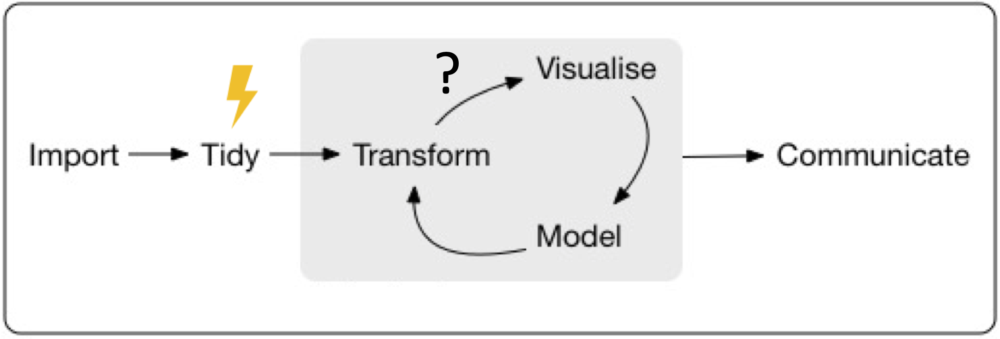

```{r setup, include=FALSE}
knitr::opts_chunk$set(echo = TRUE)
library(targets)
library(tarchetypes)
library(xaringanthemer)
style_mono_accent(
  base_color = "#006682",
  text_font_size = "1.2rem",
  extra_css = list(
    ".small" = list("font-size" = "60%")
  ))
```

## Modular, reproducible bioinformatics workflows with the {targets} R package

**Joel Nitta**

ICSB Academy <span style = 'font-size: 120%;'>2022/06/31</span>

<br><br>

<br><br><br>https://joelnitta.github.io/icsb-targets-intro

---

## Self-introduction

.pull-left[
@joel_nitta

https://joelnitta.com

- Project Research Associate @ [Tokyo University](http://iwasakilab.k.u-tokyo.ac.jp/)

- Research interests: Ecology and evolution of __ferns__

- Hobbies: Running (after my 6YO!)
]

.pull-right[

.small[Photo: J-Y Meyer]
]

---
## Outline of today's talk

### Part I

- Introduction to {targets}

- Live coding

### Part II

- How to use {targets} in bioinformatics

- Demo: VCF workflow

To follow along with live coding, install [R](https://www.r-project.org/), [RStudio](https://www.rstudio.com/products/rstudio/download/), and [targets](https://github.com/ropensci/targets)

---
class:inverse, center, middle

# Part I

---
## Why {targets}?

--

### To make your code more reproducible

---
## What is reproducibility?

--

> The ability for others (or your future self) to re-run your code and get the same results

--

- Not "yes" or "no"
- Reproducibility = **mindset**
- Many aspects
  - Computing environment
  - Data availability
  - **Code automation**
  
---
## Workflows in R


**Which steps** need to be run **in what order**?

.footnote[R for Data Science https://r4ds.had.co.nz/]

---
## Workflows in R



If **one part** of a workflow changes, **how does it affect other parts?**

**How much of it do we need to re-run?**

---

## What is {targets}?

.pull-left[
- Automates workflow

- Only runs necessary steps

- Can run workflow steps in parallel (speeds up analysis)

- Provides proof that **results** are derived **from code**
]


---
## Resources

- Github https://github.com/ropensci/targets

- Package website https://docs.ropensci.org/targets/

- User manual https://books.ropensci.org/targets/

- Targetopia https://wlandau.github.io/targetopia/

- {tarchetypes} website https://docs.ropensci.org/tarchetypes/

- Discussion board https://github.com/ropensci/targets/discussions

---
## Live Coding

- `tar_script()`: Write a generic workflow script

- `tar_visnetwork()`: Visualize the state of the workflow

- `tar_make()`: Run the workflow

- `tar_load()`: Load a target from the workflow

- `tar_outdated()`: List which steps will be run next time

---
class: inverse, center, middle

# Live Coding

---
## Summary

- Write your workflow plan in `_targets.R`

- Run your workflow with `tar_make()`

- Check the status of your workflow with `tar_visnetwork()`

- Use `tar_file()` to track external files

---
## Example workflow

Gapminder workflow

- https://github.com/joelnitta/targets_gapminder_example

---
class:inverse, center, middle

# Part II

---
## Using {targets} for bioinformatics

{targets} was originally designed for workflows **in R**

--

How can we use {targets} in workflows that use **other software?**

--

- Input and output of each step is a **file** (or files)
- Write **wrapper functions** to call programs from R
- Use **docker** containers for external programs
- Use **(mini)conda** to maintain R environment

---
## Workflow with files

Store files in **`_targets/user/`**

Allows you to snapshot your workflow state with [{gittargets}](https://github.com/ropensci/gittargets)

If there is a long-running step (or steps), you could roll back to a particular
code commit in {targets}, then checkout the matching workflow state 
**without re-running everything**

---
## Workflow with files

Store files in **`_targets/user/`**

My recommendation:

```
_targets/
└── user
    ├── data
    ├── intermediates
    └── results
```

- `data`: raw data files
- `intermediates`: output / input of intermediate steps
- `results`: final output (e.g., manuscript)

---
## Wrapper functions

R functions that call external programs.

- `system()`: most basic form, just runs exactly the input given
- `system2()`: slightly more complicated
- **`processx::run()`**
  - allows for asynchronous processes
  - can specify different working directory
  - redirection of `stderr` and `stderr`
  - many other features

Syntax:

```r
processx::run(command, args)
```

---
## Use docker for external programs

- Don't need to install program (and all of its dependencies)
- Can specify / track version

--

We don't have time to cover details today

Recommended resource: 
- Carpentries Incubator Workshop ["Reproducible Computational Environments Using Containers"](https://carpentries-incubator.github.io/docker-introduction/index.html)

---
## Wrapping docker calls from R

babelwhale R package: https://github.com/dynverse/babelwhale

`babelwhale::run()` has similar syntax to `processx::run()`

.pull-left[
```{r, eval = FALSE}
babelwhale::run(
  container, #<<
  command, args)
```
]

---
## Loading files into docker: volume mounts

In order to connect the docker container to your files, you need to **mount** the directory.

```
docker run -v /path/to/local/dir:/path/to/container/dir
```
---
## Loading files into docker

```{r, eval = FALSE}
wd <- getwd()

babelwhale::run(
  container = "alpine",
  command = "ls",
  args = c("/wd_in_docker", "-l", "-h"),
  volumes = paste(wd, ":/wd_in_docker", sep = "") #<<
  )

```

This gets confusing with multiple files and folders...

---
## My fork of {babelwhale}

Includes `run_auto_mount()` function to make it easier to mount files.

**For any file or folder argument, just provide the local path and name it "file"**

```{r run-auto-ex-1, eval = FALSE}
# Install my fork of babelwhale
remotes::install("joelnitta/babelwhale@jnfeat")

babelwhale::run_auto_mount(
  container = "alpine",
  command = "ls",
  args = c(file = wd, "-l", "-h") #<<
  )
```

---
## Example of run_auto_mount(): clean reads with fastp
```{r, eval = FALSE, echo = TRUE}
# Download some example read files
download.file(
  url = "https://raw.githubusercontent.com/OpenGene/fastp/master/testdata/R1.fq",
  destfile = "R1.fq")
download.file(
  url = "https://raw.githubusercontent.com/OpenGene/fastp/master/testdata/R2.fq",
  destfile = "R2.fq")

babelwhale::run_auto_mount(
  container = "quay.io/biocontainers/fastp:0.23.1--h79da9fb_0",
  command = "fastp",
  args = c(
    "-i", file = "R1.fq",
    "-I", file = "R2.fq",
    "-o", file = "R1_trim.fq",
    "-O", file = "R2_trim.fq",
    "-h", file = "trim_report.html"
  )
)
```

---
## Using run_auto_mount() in a wrapper function

```{r, eval = TRUE, echo = TRUE}
# Define function to trim read files
trim_reads <- function(
  f_read_in, r_read_in,
  f_read_out, r_read_out,
  report) {
  babelwhale::run_auto_mount(
    container = 
    "quay.io/biocontainers/fastp:0.23.1--h79da9fb_0",
    command = "fastp",
    args = c(
      "-i", file = f_read_in,
      "-I", file = r_read_in,
      "-o", file = f_read_out,
      "-O", file = r_read_out,
      "-h", file = report
      )
  )
  # Return the output file paths
  c(f_read_out, r_read_out)
}
```
---

## Using run_auto_mount() in a wrapper function

```{r, eval = FALSE}
# Run function
trim_reads(
  "R1.fq", "R2.fq",
  "R1_trim.fq", "R2_trim.fq",
  "trim_report.html"
)
```

---
## Putting it together: Variant calling workflow

- https://github.com/joelnitta/targets_vcf_example

- Based on Data Carpentry ["Data Wrangling and Processing for Genomics"](https://datacarpentry.org/wrangling-genomics/04-variant_calling/index.html)

---
.pull-left[
  Function
```{r, eval = FALSE}
sam_to_bam <- function(
  sam, out_dir) {
  # Format output file
  out_file <- 
    fs::path_file(sam) %>%
    fs::path_ext_remove() %>%
    fs::path_ext_set(".bam") %>%
    fs::path(out_dir, .)
  # Run docker
  run_auto_mount(
    container_id = "quay.io/biocontainers/samtools:1.9--h91753b0_8",
    command = "samtools",
    args = c(
      "view", "-S",
      "-b", file = sam),
    stdout = out_file
  )
  out_file
}
```
]

.pull-right[
Workflow
```{r, eval = FALSE}
# Convert SAM to BAM
  tar_file(
    aligned_bam,
    sam_to_bam(
      aligned_sam,
      out_dir = "results/bam"),
    pattern = map(aligned_sam)
  )
```
]

---
## One final detail: environment for R

Docker is great for maintaining reproducible computing environments.

But how do we maintain the **environment that is calling docker?** `r emo::ji("thinking")`

--

Solution: use [conda](https://docs.conda.io/en/latest/miniconda.html) and [renv](https://rstudio.github.io/renv/articles/renv.html)

---
## conda

Use an `environment.yml` file to define needed software:

```
name: bioinfo-example-env
channels:
  - conda-forge
  - bioconda
  - defaults
dependencies:
  - r-renv=0.14.*
```

---
## conda

- Install with `conda env create -f environment.yml`
- Activate with `conda activate bioinfo-example-env`
- Deactivate with `conda deactivate`

---
## renv

Our conda environment includes R and the {renv} package, which is a package manager for R.

{renv} uses a file called `renv.lock` to track R package versions. For example,

```
"Matrix": {
      "Package": "Matrix",
      "Version": "1.3-4",
      "Source": "Repository",
      "Repository": "CRAN",
      "Hash": "4ed05e9c9726267e4a5872e09c04587c"
    }
```

---
## renv

- Turn on with `renv::activate()`
- Install packages with `renv::restore()`
- Update packages with `renv::snapshot()`

You should track `renv.lock` with git. This way, any changes to package versions are all documented.

---
## Variant calling workflow

- https://github.com/joelnitta/targets_vcf_example

Includes `environment.yml` and `renv.lock` files needed to reproduce analysis.

To run the analysis, do:

```
conda activate bioinfo-example-env
Rscript -e targets::tar_make()
```

---
class: inverse, center, middle

# Questions?
